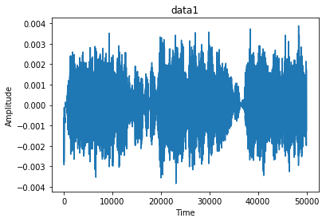
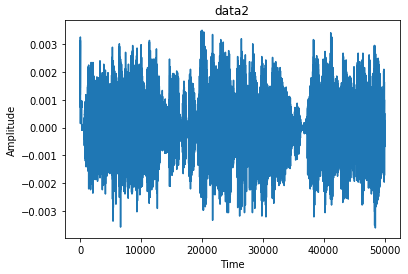
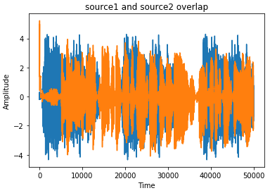

# Cocktail_Party_Problem

**Note** The code is taken from the repo - https://github.com/vishwajeet97/Cocktail-Party-Problem. Some changes have been made. 

Cocktail Party Problem or the Blind Source Separation is a classical problem.
The motivation for this problem is, imagine yourself in a party with a lot of people.
There will be a sort of cacaphony becasue of all the people taling at the same time.
Now you can shut out the voices in the background to hear some specific conversation.
We also want to do the same and let's formalize what we are trying to do.
Let's say there are m sources which are producing signal according to some distribution independent of each other and we have n microphones which record the signals arriving at them.
We try to decipher the underlying source signals from the mixed signals arriving at the microphones.
We will try and constraint the problem a little more so that we can move forward.
The first assumption is that the mixed signals are a linear combination of the source signals.
The second assumption is that the number of source and number of microphones are equal.

# FastICA

The FastICA algorithm uses a fixed-point iteration scheme to try and find the independent componenets. It is very sensitive to the functions used for approximating the negentropy. The math behind the algorithm takes some time to understand but intuitively they are trying to find the vectors which maximizes the non-gaussanity of the signals.
To understand the algorithm fully I would encourage you to dive straight into the paper itself
[Independent Component Analysis:Algorithms and Applications](https://www.sciencedirect.com/science/article/pii/S0893608000000265) - *A. Hyvärinen and E. Oja*

# Working

- The main implementation is done in two ways, using the inbuilt FastICA in sklearn and without using sklearn
- Put your sound clips (wav file) in mixed with name "mixedX" and "mixedY" and run the either fastICA_sklearn.py or fastICA_no_sklearn.py, the separated sources will appear in the main folder.
- If using your own clips, put both clips in sources folder, under the name sourceX and sourceY, and run preprocess.py and the output will give mixedX and mixedY wav files.

Here is the waveform of both the sound clips, i.e. mixedX and mixedY

&emsp;&emsp;

Here is the waveform of the combined audio

  

Here is the waveform of the separated audio

&emsp;&emsp;

